# Credit_Risk_Analysis

## Overview of Analysis
Using Python to build and evaluate various machine learning models to predict credit risk. Oversampled the data using RandomOverSampler and SMOTE algorithms, undersampled the data using the ClusterCentroids algorithm, and compared two machine learning models that reduce bias, BalancedRandomForestClassifier and EasyEnsembleClassifier. After evaluating these models, I will make a recommendation on whether they should be used to predict credit risk. 

## Resources
- Data: 
  - [LoanStats_2019Q1.csv]("../resources/LoanStats_2019Q1.csv")
- Software: 
  - Python
  - Anaconda
  - Jupyter Notebook

## Results
### SMOTE Oversampling
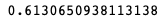
The balanced accuracy score is 61.3%.

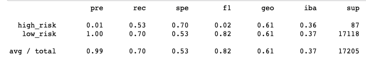
Because of the high number of the low_risk population, the precision is almost 100% with a sensitivity of 66%.

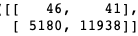

### ClusterCentroids Model
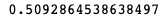
The balanced accuracy score is 51%.

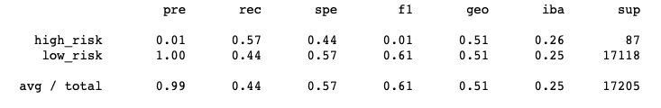
Because of the high number of false positives, the low_risk sensitivity is about 44% for this model, with a precision of about 100%. 

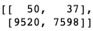

### Ease Ensemble AdaBoost Classifier
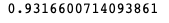
This balanced accuracy score is high, about 93.2%.

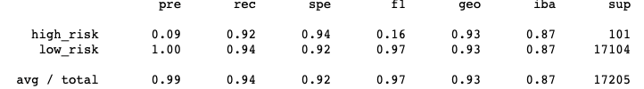
Because of a low number of false positives, the low_risk sensitivity is 92% with 100% precision. 

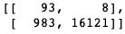

### BalancedRandomForestClassifier Model
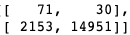
The balanced accuracy score is about 79%.

The high risk precision is about 3% with a sensitivity of 70%. Due to the high number of the low_risk population, the precision is almost 100% with a sensitivity of 87%.

### Naive Random Oversampling
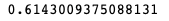
The balanced accuracy score is about 61.4%.

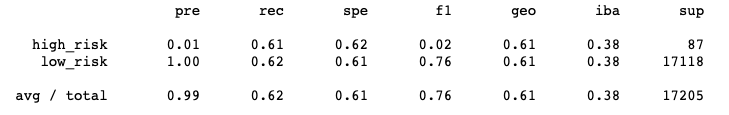
The high risk precision is about 1% with a sensitivity of 61%, while the low risk precision is 100% with a sensitivity of about 62%.

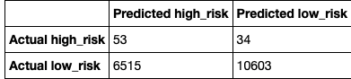

### Combo - Over and Under Sampling
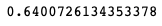
The balanced accuracy score is 64%.

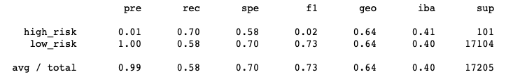
The high risk precision is 1% with a sensitivity of 70%, while the low risk precision is 100% with a sensitivity of 58%.

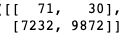

## Summary
Every model I evaluated to predict credit risk has shown weak precision. The models that had more improvement on the sensitivity of high risk credits was the Ensemble models. The EasyEnsembleClassifier model has a recall of 92%, detecting almost all high risk credit. However, with low precision, a lot of low risk credits are falsely detected as high risk, which could hurt the bank by missing those opportunities. Because of this specific situation and the models showing weak precision, I would not recommend any of these models to predict credit risk to the bank. For a bank, you want to have high precision so that you can strategize opportunities to increase revenue. 
